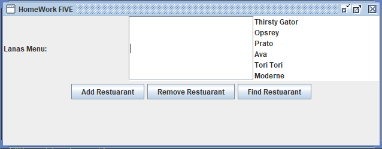

# AlanasProject

AlanasProject is a Java-based application developed as part of a homework assignment. The objective was to create a program using a Graphical User Interface (GUI) that incorporates various concepts learned in class.

This project was inspired by a real-life scenario where my girlfriend and I were planning a date night but couldn't decide where to go. I created this program to help us choose a restaurant.



## Features

- **Add and Remove Restaurants**: Easily manage your list by adding new restaurants or removing ones you no longer wish to consider.
- **Automatic Saving and Loading**: The program automatically saves your restaurant list to a `.txt` file and loads it when you start the application.
- **Randomly Select a Restaurant**: Struggling to choose? Let the program randomly select a restaurant for you.

## How to Use

- **Add a Restaurant**: Enter the restaurant's name and click "Add" to add it to your list.
- **Remove a Restaurant**: Select a restaurant from the list and click "Remove" to delete it.
- **Find a Restaurant**: Click "Find" to have the program randomly select a restaurant for you.

Your list is automatically saved to a `.txt` file and will be loaded the next time you open the application, so you never lose your selections.

## Getting Started

To run this program, you'll need to have Java installed on your system. Simply clone this repository and execute the program from your IDE or command line.

```bash
git clone https://github.com/TylerPac/AlanasProject.git
cd AlanasProject
# Open in your preferred Java IDE and run the project
```